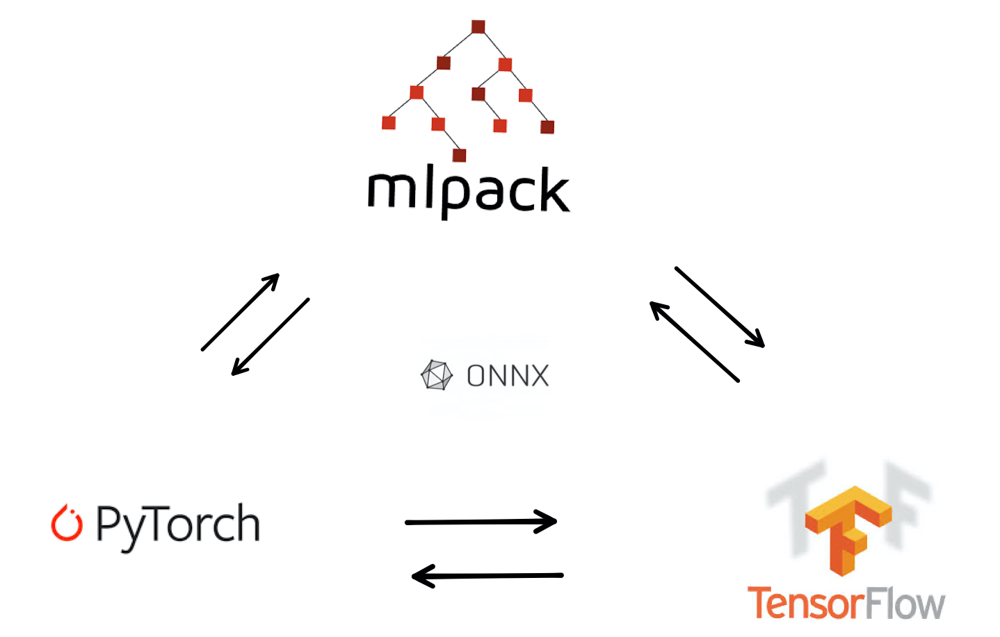

# mlpack-TensorFlow Translator

<div align="center">

<p></p>
</div>

## Dependencies

- **Primary Dependencies : boost, armadillo, ensmallen, mlpack**
- C++11 is the minimum version required for cpp.

## Functionality

The name of the repository is a misnomer as none of the functionalities have
anything to do with Tensorflow directly. However, it allows
to convert onnx models to mlpack and any Tensorflow model can be
converted into onnx using [onnx-tensorflow](https://github.com/onnx/onnx-tensorflow).

This library can do two types of conversions currently.

- Converting mlpack models to torch (See example in mlpack_to_torch_test.cpp file)
- Converting onnx models to mlpack (See example in onnx_to_mlpack_test.cpp file)

This library also includes a header file only implementation of a standalone
model parser that can parse json files containing user-defined model details
to train neural networks.

For the conversion process, the library currently has tested support for
linear and convolutional layers. Further support can be added as and when
more examples are available in the ```examples``` folder.

For seeing examples of the library in work, check out the ```tests``` folder.

---

## Notes regarding future development tasks

There are some parts of the code marked with #TODO.
Those issues need to be resolved. Apart from that, there are the following points.

### mlpack layers that need some modification

- [x] BatchNorm - Missing argument `momentum` ✅
- [ ] MaxPool - Missing argument `pads` ❌
- [ ] Convolution - Missing argument `group` ❌
- [ ] Selu (elu) - Argument `lambda` (called gamma in onnx) is not modifiable ❌

### mlpack layers that need to be added

- [x] Softmax - We have LogSoftmax and not softmax but many of the popular
   pre-trained models in the onnx zoo use softmax ✅
- [ ] LRN - The AlexNet model of onnx uses LRN, so it's a must if we are to support
   AlexNet ❌

**Reference to the onnx models can be found at**
<https://github.com/onnx/onnx/blob/master/docs/Operators.md>

---
